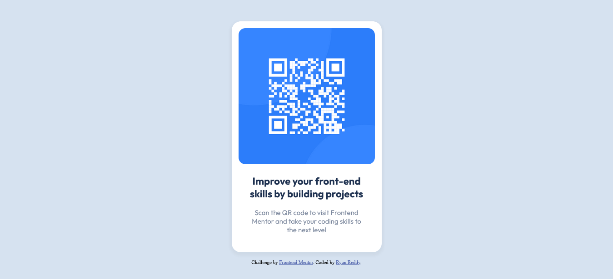

# Frontend Mentor - QR code component solution

This is a solution to the [QR code component challenge on Frontend Mentor](https://www.frontendmentor.io/challenges/qr-code-component-iux_sIO_H). Frontend Mentor challenges help you improve your coding skills by building realistic projects. 

## Table of contents

- [Overview](#overview)
  - [Screenshot](#screenshot)
  - [Links](#links)
- [My process](#my-process)
  - [Built with](#built-with)
  - [What I learned](#what-i-learned)
  - [Continued development](#continued-development)
- [Author](#author)

## Overview

### Screenshot

### Links

- Solution URL: [https://www.frontendmentor.io/solutions/qr-code-component-using-html-and-css-Vfv3vcehXt]
- Live Site URL: [https://ryanrreddy.github.io/qr-code-component/]

### Built with

- Semantic HTML5 markup
- CSS custom properties
- Flexbox
- CSS Grid
- Mobile-first workflow

### What I learned

I have started learning web development from December 2023, after a month of learning I think this was a good project to work on. I did reference another solution and websites to help build the website.

### Continued development

I am continuing to learn CSS and would like to learn JavaScript next.  

## Author

- Website - [https://github.com/RyanRReddy]
- Frontend Mentor - [@RyanRReddy](https://www.frontendmentor.io/profile/RyanRReddy)